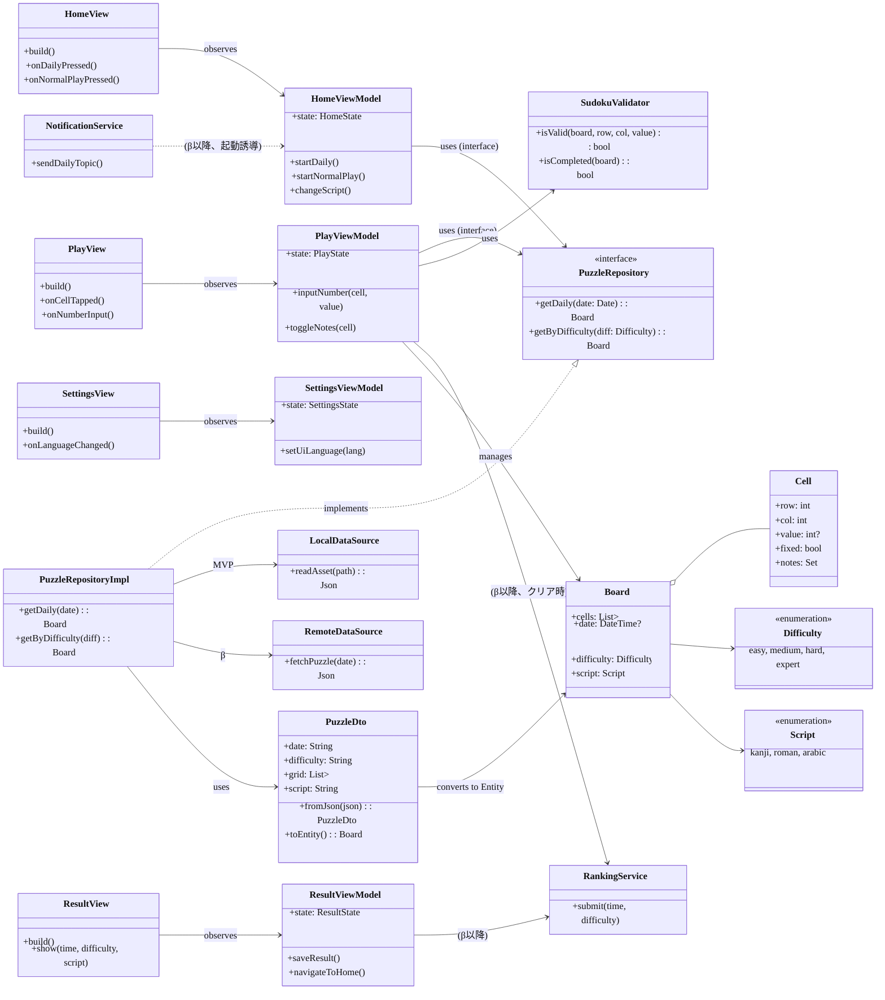
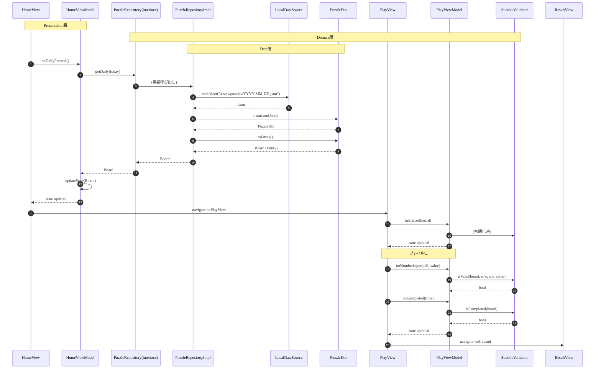
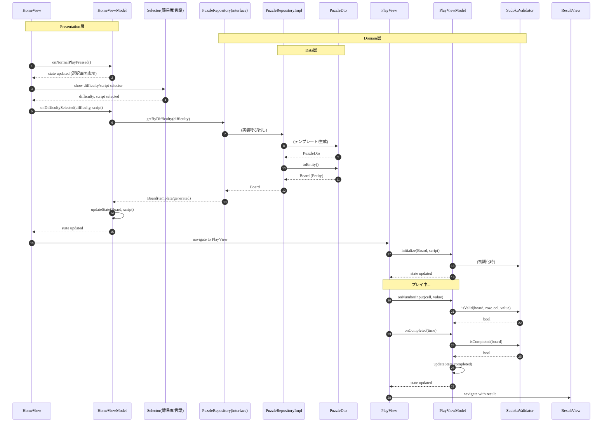
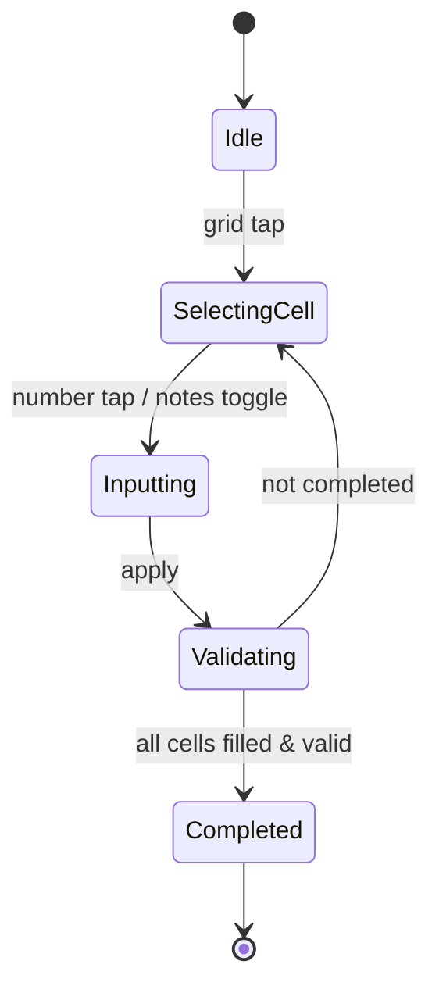

# 📐 UML（MVP設計ベース）

本ドキュメントは、`docs/基本設計.md` と `docs/詳細設計_MVP.md` を元にしたUMLです。

---

## 1. クラス図（主要モジュール・Clean Architecture + MVVM構成）


---

## 2. シーケンス図：デイリー開始（MVP・Clean Architecture + MVVM）


---

## 3. シーケンス図：デイリー開始（β・Clean Architecture + MVVM）
```mermaid
%%{init: { 'theme':'default', 'themeVariables': { 'fontSize': '22px', 'fontFamily': 'Noto Sans, Arial, sans-serif', 'primaryTextColor': '#111111' } }}%%
sequenceDiagram
  autonumber
  participant H as HomeView
  participant HV as HomeViewModel
  participant RI as PuzzleRepository(interface)
  participant RImpl as PuzzleRepositoryImpl
  participant F as RemoteDataSource(Firestore)
  participant DTO as PuzzleDto
  participant P as PlayView
  participant PV as PlayViewModel
  participant SV as SudokuValidator
  participant N as NotificationService(FCM)
  participant RS as RankingService

  Note over H,HV: Presentation層
  Note over RI,SV: Domain層
  Note over RImpl,DTO: Data層

  Note over N: 毎朝09:00 JSTに配信通知（トピックdaily）
  N..>HV: 通知受信
  HV-->>H: state updated (通知あり)
  H->>HV: onDailyPressed()
  HV->>RI: getDaily(today)
  RI->>RImpl: (実装呼び出し)
  RImpl->>F: fetchPuzzle(today)
  alt 配信済み
    F-->>RImpl: Json
    RImpl->>DTO: fromJson(Json)
    DTO-->>RImpl: PuzzleDto
    RImpl->>DTO: toEntity()
    DTO-->>RImpl: Board (Entity)
    RImpl-->>RI: Board
    RI-->>HV: Board
    HV->>HV: updateState(Board)
    HV-->>H: state updated
    H->>P: navigate to PlayView
    P->>PV: initialize(Board)
    PV->>SV: (初期化時)
  else 未取得/オフライン
    Note over RImpl: 前回取得の前日分を練習扱い（ランキング送信不可）
    RImpl-->>RI: Board(prev)
    RI-->>HV: Board(prev)
    HV->>HV: updateState(Board(prev))
    HV-->>H: state updated
    H->>P: navigate to PlayView (練習モード)
    P->>PV: initialize(Board(prev))
  end
  Note over P,PV: プレイ中...
  P->>PV: onNumberInput(cell, value)
  PV->>SV: isValid(board, row, col, value)
  SV-->>PV: bool
  P->>PV: onCompleted(time)
  PV->>SV: isCompleted(board)
  SV-->>PV: bool
  PV->>RS: submit(time, difficulty) (β以降)
  PV->>PV: updateState(completed)
  PV-->>P: state updated
  P->>ResultView: navigate with result
```

---

## 4. シーケンス図：通常プレイ（共通・Clean Architecture + MVVM）


---

## 5. 状態図：Play画面


---

## 6. 注記

### アーキテクチャ
- **Clean Architecture + MVVM**: Presentation → Domain ← Data の依存関係を明確化
- **Presentation層**: View（UI表示のみ）+ ViewModel（状態管理・Repository呼び出し）
- **Domain層**: UseCase（ビジネスロジック）、Entity（ドメインモデル）、Repository Interface（抽象化）
- **Data層**: Repository実装、DataSource、DTO（データ変換）

### 設計原則
- **依存関係の逆転**: Domain層が独立し、Data層がDomain層のインターフェースに依存
- **レイヤー分離**: Presentation層・Domain層はMVP→βで変更不要（Data層のみ変更）
- **状態管理**: ViewModelはRiverpodの`StateNotifier`を使用し、ViewはViewModelの状態を監視

### データフロー
- **MVP**: LocalDataSource → PuzzleDto → Board (Entity) → ViewModel
- **β**: RemoteDataSource → PuzzleDto → Board (Entity) → ViewModel
- **DTO変換**: Data層のDTOをDomain層のEntityに変換（`toEntity()`）

### ゲームロジック
- **ルール判定**: `SudokuValidator`（Domain層のUseCase）で処理
- **デイリー**: 端末生成を禁止し、固定配布データのみ使用（MVP=assets、β=Firestore）
- **前日キャッシュ**: 練習扱いでランキング送信不可
